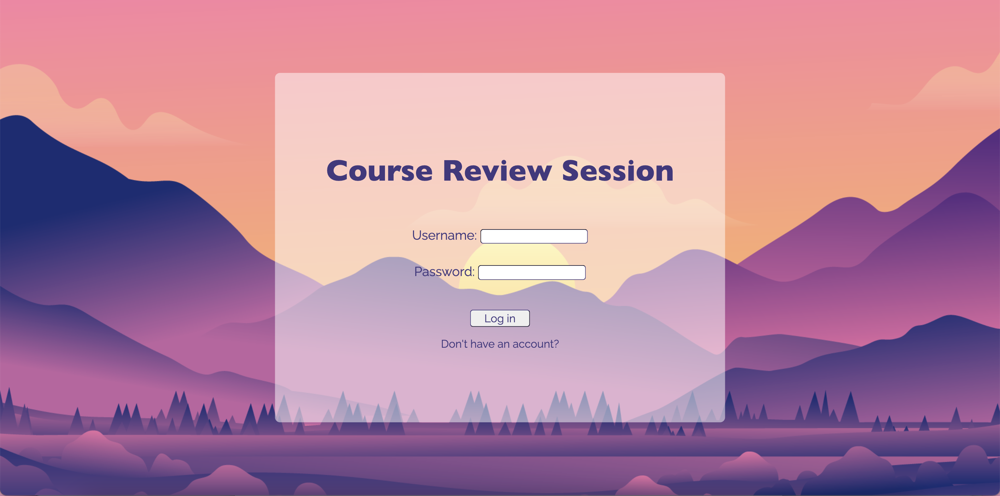

# Course Review Session

> Author: Naiyi Zhang & Yunke Nie
>
> Course Link: https://johnguerra.co/classes/webDevelopment_fall_2023/
> 
> Design Document: https://github.com/Tiffanyxk3/CourseReviewSession/blob/main/docs/DesignDocument_Project3_CS5610.pdf
> 
> Deployment: https://course-review-sessions.onrender.com
> 
> Demo Video: https://www.youtube.com/watch?v=eIJoSpbhsqY

## Project Objective

### Description

A dynamic online platform designed for collaborative learning and knowledge sharing through review sessions. This web application empowers session initiators to post, edit, and delete session content while facilitating user participation. All users have the ability to join and leave sessions using a unique session id.

### User persona & stories

1. Nigel is a graduate student majoring in computer science. Nigel is an active student in school and enjoys collaborating with his peers on coding projects. He also has taken on a leadership role in organizing study group in several computer classes.
   - Nigel wants to create a study session for upcoming exam, so he can collaborate with his peers and ensure we all prepare well for the exam
   - Nigel wants to join the review session for the upcoming exam to discuss and prepare the exam
2. John is a professor in the computer science department. He is very dedicated to his courses and spends a lot of his time working on solving students’ questions. John wants to have a platform to gather students together to solve their questions efficiently.
   - John wants to host a review session to do the Q&A session
   - John wants to let his students know what will be covered in the Q&A session

### Functionalities

1. Account Management
  - [x] Sign up: Allows new users to create an account by providing a username, password, name,  major, and tags (to indicate the user is a student or professor or TA).
  - [x] Log in: Allows existing users to log in to their account using their username and password.
  - [x] Log out: Allows users to log out of their account.
  - [x] Edit profile: Allows users to update their info (major, tag).
  - [x] Delete account: Allows users to delete their accounts.
2. Session Management
  - [x] Create a new session: Allows users to create a new review session by providing details such as the course number, time, and description.
  - [x] Edit an existing session: Allows users to edit the details of a session they have created.
  - [x] Delete a session: Allows users to delete a session they have created.
3. User & Session Interaction
  - [x] Join a session: Allows users to join an existing review session.
  - [x] Quit a session: Allows users to leave a session they have joined.
4. Browsing & Searching Sessions
  - [x] Browse all available sessions: Allows users to see a list of all available review sessions.
  - [x] Search for sessions: Allows users to search for review sessions based on course number.

### Technology & Framework

- JavaScript
- React, HTML, CSS, AJAX
- Node, Express
- MongoDB
- Nodemon, ESlint, Prettier

## Screenshots



## Usage

After cloning the repository, run the following commands in the root directory of the project:

```
cd front
npm install
npm run build
cd ..
npm install
npm start
```

// Code Review: Yue Wu
